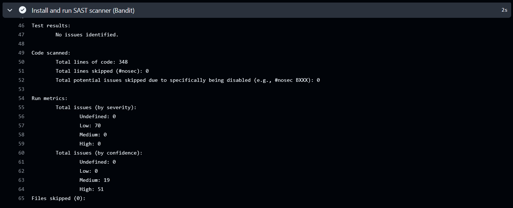
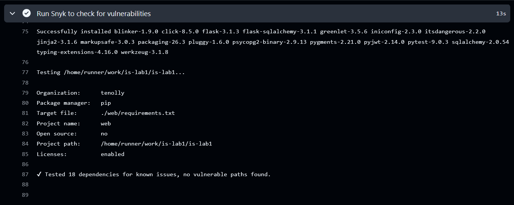
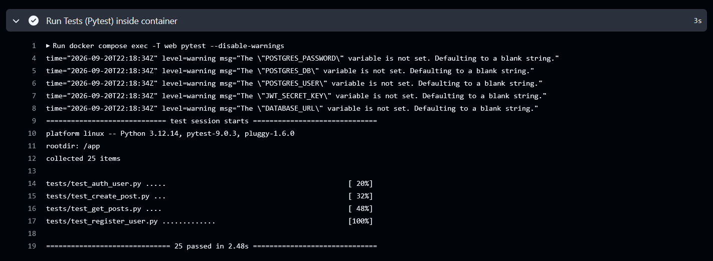

# Описание проекта и API

Проект написан на Python с использованием фреймворка Flask и использованием ORM SQLAlchemy. В качестве базы данных используется PostgreSQL. Проект запускается в Docker Compose.

Реализованы следующие ручки:
- POST /auth/register - метод для создания пользователя (принимает логин и пароль).
- POST /auth/login - метод для аутентификации пользователя (принимает логин и пароль).
- GET /api/data - метод для получения постов пользователя. Доступ только у аутентифицированных пользователей.
- POST /api/data - метод для создания постов (содержание поста: заголовок, описание). Доступ только у аутентифицированных пользователей.

# Описание реализованных мер защиты

## Защита от SQLi (SQL-инъекций)

Приложение использует ORM SQLAlchemy. 

При передаче значений через методы ORM SQLAlchemy (например, `.filter_by(login=login)`) автоматически обрабатывает переданные данные как параметры (использует их для вставки через параметризацию `"(?, ?, ?)"`), а не как часть исполняемого SQL-запроса.

При этом приложение не использует сырые SQL запросы, поэтому лазеек для использования SQL-инъекций нет

## Защита от XSS

Для всех пользовательских данных (заголовки и описания постов) используется функция `escape` из библиотеки `markupsafe`, которая заменяет специальные символы в строке на их безопасные HTML-сущности (например, `<` превращается в `&lt;`).

Реализовано в методах, работающих с постами:
- `POST /api/data`
- `GET /api/data`

## Защита от Broken Authentication

Реализована JWT авторизация с помощью библиотеки `pyjwt`:
- При запросе на `POST /auth/login`, если логин и пароль корректные, пользователю выдается access_token (`subject` - id пользователя, время жизни 1 час). Для криптографической подписи используется `HS256` (secret key задается в `.env` файле).
- На ручки, которые требуют аутентификацию, добавлен middleware проверяющий jwt token (если тот некорректный или истек - отдаем 401 ошибку). Если токен корректный, достаем из него id пользователя (поле `subject`) и используем для получения/создания данных.

Как уже упоминалось выше, разработан middleware (декоратор token_required), который применяется к методам, которым нужна авторизация:
- `POST /api/data`
- `GET /api/data`

Пароли хранятся в виде хэша. Алгоритм хэширования - `scrypt` (дефолтный алгоритм у `generate_password_hash` из `werkzeug.security`).

# Скриншоты отчетов SAST/SCA

## Отчет SAST (Bandit)

https://github.com/tenolly/is-lab1/actions/runs/35541208499/job/106159097224



## Отчет SCA (Synk)

https://github.com/tenolly/is-lab1/actions/runs/35541208499/job/106159097130



# Ссылка на последний успешный запуск pipeline

https://github.com/tenolly/is-lab1/actions/runs/35541208499

Помимо sast/sca, также проходят и тесты приложения:



Локально можно подергать приложение через curl:

```bash
docker compose up
docker compose exec -it web apk add curl
docker compose exec -it web sh
```
```bash
curl -X POST -H "Content-Type: application/json" -d '{"login":"nikita","password":"Password_1"}' http://localhost:5000/auth/register
curl -X POST -H "Content-Type: application/json" -d '{"login":"nikita","password":"Password_1"}' http://localhost:5000/auth/login
curl -X POST -H "Content-Type: application/json" -H "Authorization: Bearer <acces_token>" -d '{"title": "Cool Story", "description": "<script>Steal data<script>"}' http://localhost:5000/api/data
curl -X GET http://localhost:5000/api/data -H "Authorization: Bearer <access_token>"
```
